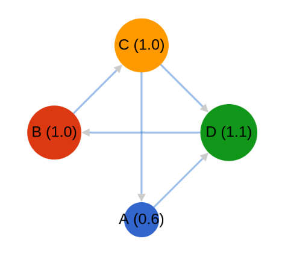

# PageRank

## Phase 1

### HDFS

Copy [data](./data) to HDFS.

```sh
❯ hdfs dfs -mkdir data
❯ hdfs dfs -put data/* data
```

### Compile

Compile and create `Phase1.jar`:

```sh
❯ hadoop com.sun.tools.javac.Main Phase1.java
❯ jar cf Phase1.jar Phase1*.class
```

### YARN

Submit job:

```sh
❯ yarn jar Phase1.jar Phase1 data pagerank_output0
```

### Result

```sh
❯ hdfs dfs -cat pagerank_output0/part-00000
A	1.0:D
B	1.0:C
C	1.0:A,D
D	1.0:B
```

## Phase 2

### Compile

Compile and create `Phase2.jar`:

```sh
❯ hadoop com.sun.tools.javac.Main Phase2.java
❯ jar cf Phase2.jar Phase2*.class
```

### YARN

Submit job:

```sh
❯ yarn jar Phase2.jar Phase2 pagerank_output0 pagerank_output1
```

### Result

```sh
❯ hdfs dfs -cat pagerank_output1/part-00000
A	0.575:D
B	1.0:C
C	1.0:A,D
D	1.4250001:B
```

The following image shows results on first iteration of PageRank.


