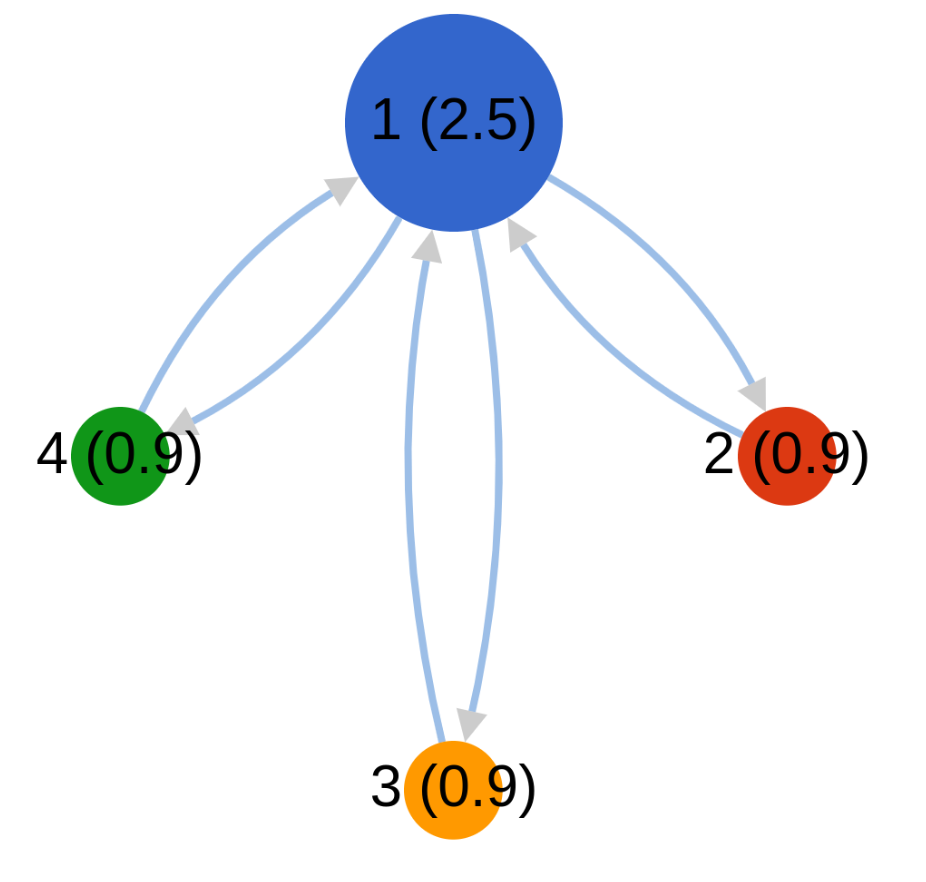

# PageRank

### Integrantes:

- Zúñiga Coayla, Jerson
- Chullunquia Rosas, Sharon

## Phase 1

### HDFS

Copy [data](./data) to HDFS.

```sh
❯ hdfs dfs -mkdir pagerank_input
❯ hdfs dfs -put data/* pagerank_input
```

### Compile

Compile and create `Phase1.jar`:

```sh
❯ hadoop com.sun.tools.javac.Main Phase1.java
❯ jar cf Phase1.jar Phase1*.class
```

### YARN

Submit job:

```sh
❯ yarn jar Phase1.jar Phase1 pagerank_input pagerank_output0
```

### Result

```sh
❯ hdfs dfs -cat pagerank_output0/part-00000
1	1.0:4,3,2
2	1.0:1
3	1.0:1
4	1.0:1
```

## Phase 2

### Compile

Compile and create `Phase2.jar`:

```sh
❯ hadoop com.sun.tools.javac.Main Phase2.java
❯ jar cf Phase2.jar Phase2*.class
```

### YARN

Submit job:

```sh
❯ yarn jar Phase2.jar Phase2 pagerank_output0 pagerank_output1
❯ yarn jar Phase2.jar Phase2 pagerank_output1 pagerank_output2
```

### Result

```sh
❯ hdfs dfs -cat pagerank_output2/part-00000
1	1.255:4,3,2
2	0.9150001:1
3	0.9150001:1
4	0.9150001:1
```

The following image shows results on first iteration of PageRank.


